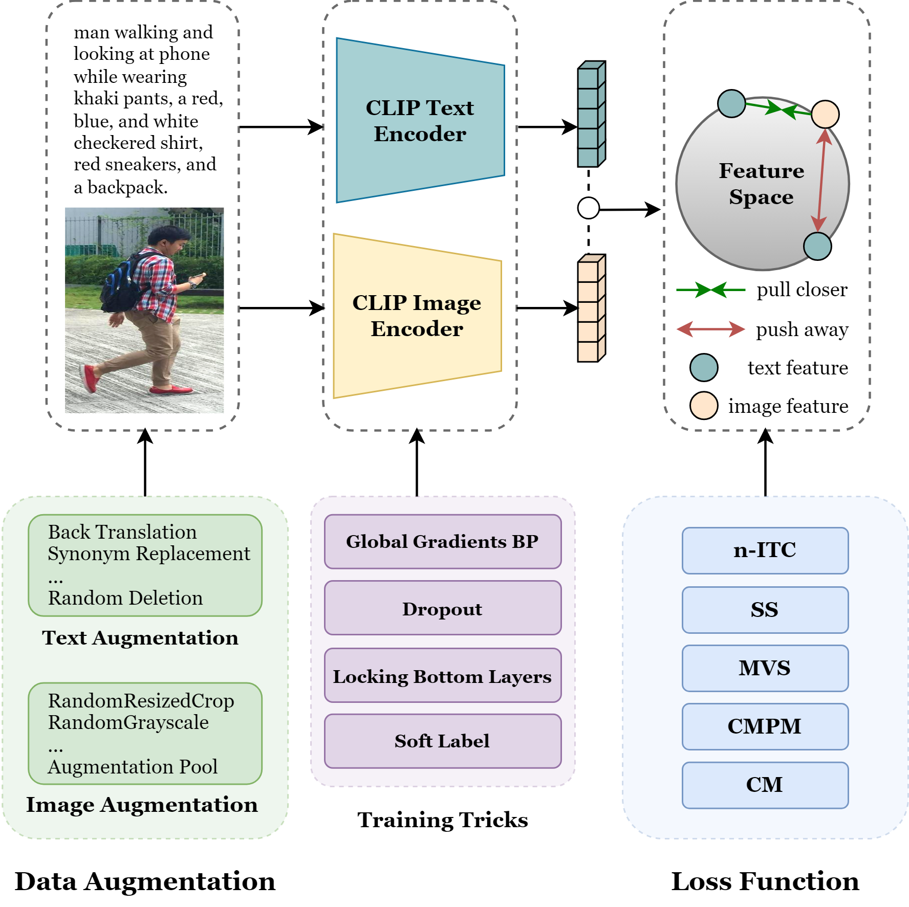

# An Empirical Study of CLIP for Text-based Person Search

This repository is the code for the paper [An Empirical Study of CLIP for Text-based Person Search]().



### Environment

All the experiments are conducted on 4 Nvidia A40 (48GB) GPUs. The CUDA version is 11.7.

The required packages are listed in `requirements.txt`. You can install them using:

```sh
pip install -r requirements.txt
```

### Download
1. Download CUHK-PEDES dataset from [here](https://github.com/ShuangLI59/Person-Search-with-Natural-Language-Description), ICFG-PEDES dataset from [here](https://github.com/zifyloo/SSAN) and RSTPReid dataset from [here](https://github.com/NjtechCVLab/RSTPReid-Dataset).
2. Download the annotation json files from [here](https://drive.google.com/file/d/1C5bgGCABtuzZMaa2n4Sc0qclUvZ-mqG9/view?usp=drive_link).
3. Download the pretrained CLIP checkpoint from [here](https://openaipublic.azureedge.net/clip/models/5806e77cd80f8b59890b7e101eabd078d9fb84e6937f9e85e4ecb61988df416f/ViT-B-16.pt)

### Configuration
In `config/config.yaml` and `config/s.config.yaml`, set the paths for the annotation file, image path and the CLIP checkpoint path.


### Training

You can start the training using PyTorch's torchrun with ease:

```sh
CUDA_VISIBLE_DEVICES=0,1,2,3 \
torchrun --rdzv_id=3 --rdzv_backend=c10d --rdzv_endpoint=localhost:0 --nnodes=1 --nproc_per_node=4 \
main.py
```

### Simplified TBPS-CLIP
You can easily run simplified TBPS-CLIP using:

```sh
CUDA_VISIBLE_DEVICES=0,1,2,3 \
torchrun --rdzv_id=3 --rdzv_backend=c10d --rdzv_endpoint=localhost:0 --nnodes=1 --nproc_per_node=4 \
main.py --simplified
```

### License
This code is distributed under an MIT LICENSE.
